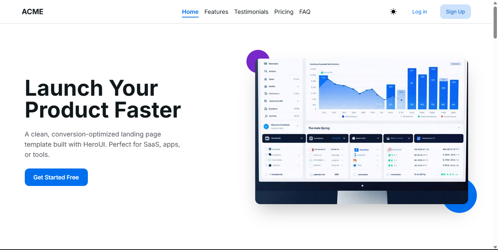

# HeroUI Landing Page Template

This is a responsive, clean, and conversion-optimized **Landing Page Template** built with [HeroUI](https://heroui.com). Ideal for SaaS, apps, tools, or any product/service showcase.
Built as part of the HeroHack 2025 submission.

## 🚀 Features

- 💡 Hero section with CTA
- 📦 Feature highlights
- 💬 User testimonials
- ⏳ Countdown offer timer
- 💰 Pricing plans
- ❓ FAQ accordion
- 📩 Newsletter signup
- 🎨 Built with HeroUI components
- 🎥 Smooth animations via Framer Motion
- 🔧 Icons via Iconify (Lucide icons)
- ⚡ Powered by Vite

## 🧱 Tech Stack

- [HeroUI](https://heroui.com)
- Vite
- Framer Motion
- Iconify (Lucide icons)

## 📸 Screenshots



## 🔗 Live Demo

[Live Link](https://bibekbhusal0.github.io/heroui-landing-page/)

## ▶️ Getting Started

Clone the repo:

```bash
git clone https://github.com/BibekBhusal0/heroui-landing-page
cd heroui-landing-page
npm install
npm run dev
```

## 📄 License

MIT
